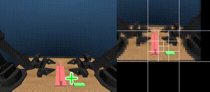

# Look, Focus, Act: Efficient and Robust Robot Learning via Human Gaze and Foveated Vision Transformers



🚀 **Project Website:** [https://ian-chuang.github.io/gaze-av-aloha/](https://ian-chuang.github.io/gaze-av-aloha/)

This repository contains the official code for our paper:
**"Look, Focus, Act: Efficient and Robust Robot Learning via Human Gaze and Foveated Vision Transformers"**

We propose a human-inspired *foveated vision framework* for robot learning that combines human gaze, [foveated ViTs](https://github.com/facebookresearch/segment_this_thing), and robotic control to enable policies that are both efficient and robust. Our approach reduces ViT computation by 94%, accelerating training by 7× and inference by 3×.

We collect bimanual robot demonstrations with synchronized human eye-tracking using the AV-ALOHA simulation platform. This repository provides code and instructions for installation, dataset preparation, model training, policy evaluation, and data collection.

```bibtex
@misc{chuang2025lookfocusactefficient,
      title={Look, Focus, Act: Efficient and Robust Robot Learning via Human Gaze and Foveated Vision Transformers}, 
      author={Ian Chuang and Andrew Lee and Dechen Gao and Jinyu Zou and Iman Soltani},
      year={2025},
      eprint={2507.15833},
      archivePrefix={arXiv},
      primaryClass={cs.RO},
      url={https://arxiv.org/abs/2507.15833}, 
}
```

## AV ALOHA Simulation Datasets

Below lists all available AV-ALOHA simulation datasets with human eye-tracking annotations. Each dataset includes over 100 episodes and a link for interactive visualization.

| Dataset | Eye Data | Episodes | Visualization |
|---------|----------|----------|--------------|
| [AV ALOHA Sim Peg Insertion](https://huggingface.co/datasets/iantc104/av_aloha_sim_peg_insertion) | ✅ | 100 | [View](https://huggingface.co/spaces/iantc104/av_aloha_visualize_dataset?dataset=iantc104%2Fav_aloha_sim_peg_insertion&episode=0) |
| [AV ALOHA Sim Cube Transfer](https://huggingface.co/datasets/iantc104/av_aloha_sim_cube_transfer) | ✅ | 200 | [View](https://huggingface.co/spaces/iantc104/av_aloha_visualize_dataset?dataset=iantc104%2Fav_aloha_sim_cube_transfer&episode=0) |
| [AV ALOHA Sim Thread Needle](https://huggingface.co/datasets/iantc104/av_aloha_sim_thread_needle) | ✅ | 200 | [View](https://huggingface.co/spaces/iantc104/av_aloha_visualize_dataset?dataset=iantc104%2Fav_aloha_sim_thread_needle&episode=0) |
| [AV ALOHA Sim Pour Test Tube](https://huggingface.co/datasets/iantc104/av_aloha_sim_pour_test_tube) | ✅ | 100 | [View](https://huggingface.co/spaces/iantc104/av_aloha_visualize_dataset?dataset=iantc104%2Fav_aloha_sim_pour_test_tube&episode=0) |
| [AV ALOHA Sim Hook Package](https://huggingface.co/datasets/iantc104/av_aloha_sim_hook_package) | ✅ | 100 | [View](https://huggingface.co/spaces/iantc104/av_aloha_visualize_dataset?dataset=iantc104%2Fav_aloha_sim_hook_package&episode=0) |
| [AV ALOHA Sim Slot Insertion](https://huggingface.co/datasets/iantc104/av_aloha_sim_slot_insertion) | ✅ | 100 | [View](https://huggingface.co/spaces/iantc104/av_aloha_visualize_dataset?dataset=iantc104%2Fav_aloha_sim_slot_insertion&episode=0) |

## Installation

Follow the steps below to set up the environment and install all necessary dependencies.

```bash
# Clone the repository and initialize submodules
git clone https://github.com/ian-chuang/gaze-av-aloha.git
cd gaze-av-aloha
git submodule init
git submodule update

# Create and activate a new Conda environment
conda create -n gaze python=3.10
conda activate gaze

# Install LeRobot
pip install git+https://github.com/huggingface/lerobot.git@483be9aac217c2d8ef16982490f22b2ad091ab46

# Install FFmpeg for video logging
conda install ffmpeg=7.1.1 -c conda-forge

# Install AV-ALOHA packages
pip install -e ./gym_av_aloha
pip install -e ./gaze_av_aloha
```

### Authentication

Make sure you're logged in to both Weights & Biases and Hugging Face:

```bash
wandb login
huggingface-cli login
```

## Download and Preprocess Dataset

We use the [LeRobot dataset format](https://github.com/huggingface/lerobot) for ease of sharing and visualization via Hugging Face.
However, LeRobot's dataloader can be slow, so we convert each dataset into a custom `AVAlohaDataset` format based on **Zarr** for faster access during training.

### Available Dataset Repository IDs

* `iantc104/av_aloha_sim_cube_transfer`
* `iantc104/av_aloha_sim_peg_insertion`
* `iantc104/av_aloha_sim_slot_insertion`
* `iantc104/av_aloha_sim_hook_package`
* `iantc104/av_aloha_sim_pour_test_tube`
* `iantc104/av_aloha_sim_thread_needle`

### Conversion Instructions

To convert a dataset to Zarr format, run the following command from the project root:

```bash
python gym_av_aloha/scripts/convert_lerobot_to_avaloha.py --repo_id <dataset_repo_id>
```

For example:

```bash
python gym_av_aloha/scripts/convert_lerobot_to_avaloha.py --repo_id iantc104/av_aloha_sim_thread_needle
```

Converted datasets will be saved under:

```
gym_av_aloha/outputs/
```

# AV ALOHA Benchmark

Train and evaluate policies using [`train.py`](./gaze_av_aloha/scripts/train.py).

Exact commands used in our simulation experiments are provided in [`experiments.txt`](./experiments.txt).
Pretrained weights are available and can be loaded via Hydra configuration.

### Pretrained ViT Weights (MAE Pretrained)

* [`iantc104/mae_vitb_vit`](https://huggingface.co/iantc104/mae_vitb_vit)
* [`iantc104/mae_vitb_low_res_vit`](https://huggingface.co/iantc104/mae_vitb_low_res_vit)
* [`iantc104/mae_vitb_foveated_vit`](https://huggingface.co/iantc104/mae_vitb_foveated_vit)

### Pretrained Gaze Models (Task‑Specific)

* [`iantc104/gaze_model_av_aloha_sim_cube_transfer`](https://huggingface.co/iantc104/gaze_model_av_aloha_sim_cube_transfer)
* [`iantc104/gaze_model_av_aloha_sim_peg_insertion`](https://huggingface.co/iantc104/gaze_model_av_aloha_sim_peg_insertion)
* [`iantc104/gaze_model_av_aloha_sim_slot_insertion`](https://huggingface.co/iantc104/gaze_model_av_aloha_sim_slot_insertion)
* [`iantc104/gaze_model_av_aloha_sim_hook_package`](https://huggingface.co/iantc104/gaze_model_av_aloha_sim_hook_package)
* [`iantc104/gaze_model_av_aloha_sim_pour_test_tube`](https://huggingface.co/iantc104/gaze_model_av_aloha_sim_pour_test_tube)
* [`iantc104/gaze_model_av_aloha_sim_thread_needle`](https://huggingface.co/iantc104/gaze_model_av_aloha_sim_thread_needle)

### Available Task Configs

* `av_aloha_sim_cube_transfer`
* `av_aloha_sim_peg_insertion`
* `av_aloha_sim_slot_insertion`
* `av_aloha_sim_hook_package`
* `av_aloha_sim_pour_test_tube`
* `av_aloha_sim_thread_needle`

### Train & Evaluate Policies

**Fov-Act (end-to-end gaze as action):**

```bash
python gaze_av_aloha/scripts/train.py \
  policy=foveated_vit_policy \
  task=<task e.g. av_aloha_sim_thread_needle> \
  policy.vision_encoder_kwargs.repo_id=iantc104/mae_vitb_foveated_vit \
  policy.optimizer_lr_backbone=1e-5 \
  wandb.enable=true \
  wandb.project=<project name> \
  wandb.entity=<your wandb entity> \
  wandb.job_name=fov-act \
  device=cuda
```

**Fov-UNet (two-stage with pretrained gaze model):**

```bash
python gaze_av_aloha/scripts/train.py \
  policy=foveated_vit_policy \
  task=<task e.g. av_aloha_sim_thread_needle> \
  policy.use_gaze_as_action=false \
  policy.gaze_model_repo_id=<gaze model e.g. iantc104/gaze_model_av_aloha_sim_thread_needle> \
  policy.vision_encoder_kwargs.repo_id=iantc104/mae_vitb_foveated_vit \
  policy.optimizer_lr_backbone=1e-5 \
  wandb.enable=true \
  wandb.project=<project name> \
  wandb.entity=<your wandb entity> \
  wandb.job_name=fov-unet \
  device=cuda
```

**Fine (full-res ViT baseline):**

```bash
python gaze_av_aloha/scripts/train.py \
  policy=vit_policy \
  task=<task e.g. av_aloha_sim_thread_needle> \
  policy.vision_encoder_kwargs.repo_id=iantc104/mae_vitb_vit \
  policy.optimizer_lr_backbone=1e-5 \
  wandb.enable=true \
  wandb.project=<project name> \
  wandb.entity=<your wandb entity> \
  wandb.job_name=fine \
  device=cuda
```

**Coarse (low-res ViT baseline):**

```bash
python gaze_av_aloha/scripts/train.py \
  policy=low_res_vit_policy \
  task=<task e.g. av_aloha_sim_thread_needle> \
  policy.vision_encoder_kwargs.repo_id=iantc104/mae_vitb_low_res_vit \
  policy.optimizer_lr_backbone=1e-5 \
  wandb.enable=true \
  wandb.project=<project name> \
  wandb.entity=<your wandb entity> \
  wandb.job_name=coarse \
  device=cuda
```

## Additional Resources

### AV-ALOHA Simulation Data Collection

To collect simulation data using AV-ALOHA:

* Install the **AV-ALOHA Unity App** on your Meta Quest Pro headset:
  👉 [AV-ALOHA Unity App](https://github.com/Soltanilara/av-aloha-unity/tree/eye-tracking)
* Follow the instructions in [`gym_av_aloha/README.md`](https://github.com/Soltanilara/gym_av_aloha) for detailed steps on data collection.

### MAE Pretraining

We provide MAE-pretrained Vision Transformers used for:

* **Foveated**
* **Fine (Full-Res)**
* **Coarse (Low-Res)**

Details and training scripts are located in:
📄 [`pretrain/README.md`](./pretrain/README.md)

### Gaze Model Training

Train a simple UNet-based model for gaze prediction using the script:

```bash
python gaze_av_aloha/scripts/train_gaze_model.py --task <task_name>
```

Supported task names:

* `thread_needle`
* `pour_test_tube`
* `hook_package`
* `slot_insertion`
* `cube_transfer`
* `peg_insertion`

The resulting models will be pushed to Hugging Face under the appropriate task-specific repo.

# Real Robot

Install ROS-Noetic

cd interbotix_ws/src
rosdep install -y --from-paths . --ignore-src --rosdistro noetic
cd ..
catkin_make -DPYTHON_EXECUTABLE=/usr/bin/python3

